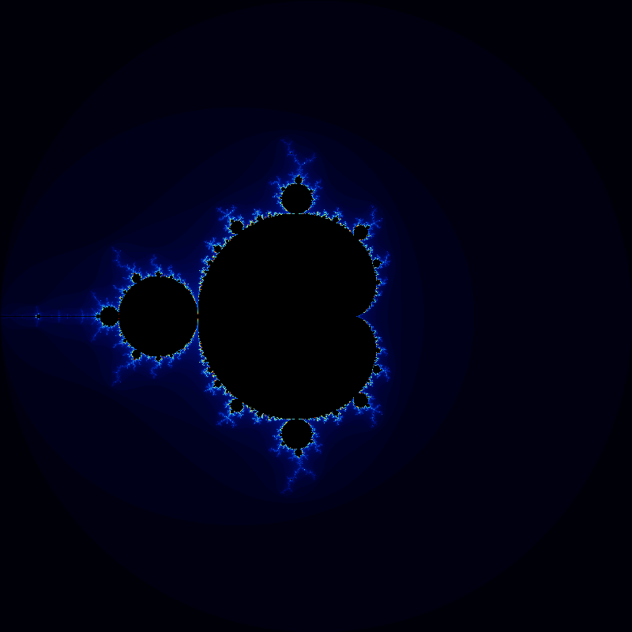

# Project 4 — NVIDIA CUDA Applications

Two standalone CUDA programs: a parallel `iota` implementation and a GPU-accelerated Julia/Mandelbrot set renderer.

---

## Files

| File | Description |
|---|---|
| `iota.cpp` | CPU version using `std::iota` — baseline for timing |
| `iota.cu` | CUDA version — each GPU thread writes one array element |
| `julia.cpp` | CPU Julia/Mandelbrot set renderer, outputs a `.ppm` image |
| `julia.cu` | CUDA version — each GPU thread computes one pixel |
| `Makefile` | Builds `iota.cpu`, `iota.gpu`, `julia.cpu`, `julia.gpu` |
| `runTrials.sh` | Runs a program 5 times and averages the reported runtimes |
| `CudaCheck.h` | Macro to check CUDA API call return codes |

---

## Building

```bash
make
```

---

## Program 1 — CUDA iota

### What it does

`iota` fills an array with sequential values starting from a given number — `[start, start+1, start+2, …]`. The CPU version calls `std::iota`; the CUDA version launches a kernel where each thread handles exactly one element:

```cuda
__global__ void iotaKernel(size_t n, DataType* values, DataType startValue) {
    size_t i = blockIdx.x * blockDim.x + threadIdx.x;
    if (i < n)
        values[i] = static_cast<DataType>(i) + startValue;
}
```

### Running the timing trials

```bash
./runTrials.sh ./iota.cpu
./runTrials.sh ./iota.gpu
```

### Results

| Implementation | Average time (ms) |
|---|---|
| CPU (`std::iota`) | 22.184 |
| CUDA kernel | 16.676 (81.6 ms first run, ~0.45 ms after warmup) |

### Question: Are the results what you expected? Why isn't CUDA a great fit here?

The results were surprising. The first GPU trial took **81.6 ms** — much slower than the CPU's 22 ms — but every trial after that dropped to around **0.45 ms**, roughly 50x faster than the CPU.

The slow first run is due to CUDA initialization overhead: loading the GPU driver, allocating device memory, and warming up the CUDA runtime all happen on the first call. After that, the GPU is hot and the kernel itself is extremely fast.

So why isn't CUDA a great solution for `iota` in practice? Because `iota` is typically a **one-shot operation** — you call it once, not in a loop. In that real-world scenario, the initialization cost dominates and the GPU loses badly. The CPU's `std::iota` runs in a tight, cache-friendly loop with no startup overhead and wins every time for a single call.

The lesson: GPUs pay off when the same kernel runs many times, or when the computation per element is heavy enough to amortize the setup cost. `iota` does neither.

---

## Program 2 — CUDA Julia Set

### What it does

For each pixel in an 800×800 image, the kernel maps the pixel to a point in the complex plane and iterates:

$$z_{n+1} = z_n^2 + c$$

counting how many iterations it takes before $|z| > 2$ (the escape condition). The iteration count drives the color. Points that never escape are inside the set and colored black.

- When `c = (0, 0)`: the program renders the **Mandelbrot set** (starting `z = 0`, varying `c` per pixel).
- With any other constant `c`: a **Julia set** (starting `z` = pixel coordinate, fixed `c`).

### Running

```bash
# Mandelbrot (default)
./julia.gpu

# Julia set with c = -0.7 + 0.27i
./julia.gpu -0.7 0.27
```

Output is written to `julia.ppm`.

### Generated Image



### Why CUDA excels here (vs. iota)

Each pixel is **independent** and requires up to 256 iterations of complex arithmetic — this is exactly the high arithmetic intensity workload GPUs are designed for. The 800×800 = 640,000 pixels map naturally onto thousands of GPU threads running in parallel, with no communication between them.
